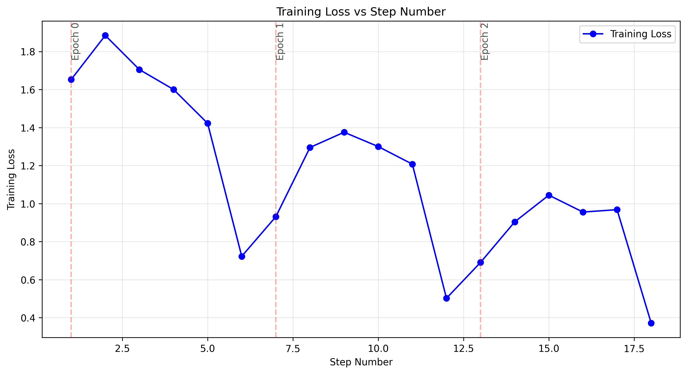

# Amazon Bedrock Nova Fine-tuning for Invoice Seller Extraction

This project prepares training data for fine-tuning Amazon Bedrock Nova models to extract seller information from Chinese VAT invoices.

## Project Structure

```
nova-fine-tunning/
│
├── README.md                           # 项目说明文档
│
├── scripts/                            # 脚本文件目录
│   ├── process_images_for_training.py  # 处理图像和创建训练数据的脚本
│   ├── upload_data_to_s3.py            # 上传训练JSON文件到S3的脚本
│   ├── generate_labels_with_llm.py     # 使用LLM生成标注数据的脚本
│   ├── visualize_training_metrics.py   # 生成训练指标图表的脚本
│   ├── visualize_detailed_metrics.py   # 生成详细训练指标图表的脚本
│   ├── nova_ft_dataset_validator.py    # 验证训练数据格式的脚本
│   ├── validate_training_dataset.py    # 验证训练数据集的脚本
│   └── run_data_preparation.sh         # 运行数据准备过程的Shell脚本
│
├── data/                               # 数据目录
│   └── invoice_sellers.csv             # 包含图像名称和销售方信息的CSV文件
│
├── InvoiceDatasets/                    # 从GitHub仓库获取的数据集
│   ├── dataset/
│   │   └── images/
│   │       └── vat_train/              # 包含发票图像的目录
│   └── label-data-for-nova-custom-fine-tunning/
│       └── output/                     # 训练JSON文件的输出目录
│
├── output/                             # 输出目录
│   ├── logs/                           # 日志文件目录
│   │   ├── nova_data_preparation.log   # 数据准备过程的日志
│   │   ├── upload_training_data.log    # 上传训练数据的日志
│   │   └── nova_validation.log         # 数据验证的日志
│   └── models/                         # 模型输出目录
│
└── docs/                               # 文档目录
    ├── training_loss_plot.png          # 训练损失图表
    └── api_reference.md                # API参考文档
```

The `InvoiceDatasets` directory is sourced from a GitHub repository: https://github.com/FuxiJia/InvoiceDatasets.git

## Prerequisites

1. AWS CLI installed and configured with appropriate permissions
2. Python 3.6+ with the following packages:
   - boto3
   - pandas

## Setup

1. Make sure your AWS credentials are configured:
   ```
   aws configure
   ```

2. Make the shell script executable:
   ```
   chmod +x scripts/run_nova_preparation.sh
   ```

## Usage

### Step 1: Prepare Training Data

Run the preparation script:
```
./scripts/run_nova_preparation.sh
```

The script will:
- Read the CSV file with image names and seller information
- Upload images to S3 bucket `aigcdemo.plaza.red` under the prefix `nova-fine-tunning/invoices/chinese/`
- Create training JSON files in the output directory
- Log the process in `output/logs/nova_data_preparation.log`

### Step 2: Upload Training JSON Files to S3

Use the upload script to send the training JSON files to S3:
```
python3 scripts/upload_training_data.py
```

Options:
- `--input-dir`: Directory containing JSON training files
- `--s3-bucket`: S3 bucket name
- `--s3-prefix`: S3 prefix (folder path)
- `--region`: AWS region
- `--dry-run`: Print files to upload without actually uploading

Example:
```
python3 scripts/upload_training_data.py --s3-prefix nova-fine-tunning/training-data-v2
```

### Step 3: Create Fine-tuning Job

Use the fine-tuning job creation script:
```
python3 scripts/create_nova_finetuning_job.py
```

Options:
- `--base-model-id`: Base model ID
- `--job-name`: Job name
- `--custom-model-name`: Custom model name
- `--training-data-s3-uri`: S3 URI for training data
- `--output-s3-uri`: S3 URI for output data
- `--role-arn`: IAM role ARN
- `--region`: AWS region
- `--epoch-count`: Number of epochs
- `--batch-size`: Batch size
- `--learning-rate`: Learning rate
- `--dry-run`: Print the job configuration without creating the job
- `--skip-s3-check`: Skip checking S3 for training data

Example:
```
python3 scripts/create_nova_finetuning_job.py --job-name "invoice-extraction-v2" --epoch-count 5
```

## Fine-tuning Process

The fine-tuning process consists of three main steps:

1. **Data Preparation**: Convert your labeled data into the required format for Nova fine-tuning
2. **Upload Training Data**: Upload the formatted data to an S3 bucket
3. **Create Fine-tuning Job**: Submit a fine-tuning job to Amazon Bedrock

The scripts in this project automate all three steps, but you can also perform them manually:

### Manual Fine-tuning with AWS CLI

```bash
aws bedrock create-model-customization-job \
  --customization-type FINE_TUNING \
  --base-model-identifier anthropic.claude-3-sonnet-20240229-v1:0 \
  --job-name "invoice-seller-extraction" \
  --role-arn "arn:aws:iam::390468416359:role/service-role/AmazonBedrockExecutionRoleForNova" \
  --custom-model-name "invoice-seller-extraction" \
  --training-data-config "s3Uri=s3://aigcdemo.plaza.red/nova-fine-tunning/training-data/" \
  --hyperparameters "epochCount=3,batchSize=1,learningRate=0.0001" \
  --output-data-config "s3Uri=s3://aigcdemo.plaza.red/nova-fine-tunning/output/"
```

## Training Data Format

The training data follows the Amazon Bedrock Nova fine-tuning format:

```json
{
  "schemaVersion": "bedrock-conversation-2024",
  "system": [{
    "text": "You are a smart assistant that answers questions respectfully"
  }],
  "messages": [{
      "role": "user",
      "content": [{
          "text": "这是一张发票图片。请识别并提取出销售方名称。只需要返回销售方名称，不要有其他文字。请确保提取的是销售方（开票方），而不是购买方（收票方）。"
        },
        {
          "image": {
            "format": "jpg",
            "source": {
              "s3Location": {
                "uri": "aigcdemo.plaza.red/nova-fine-tunning/invoices/chinese/vat_xxxx.jpg",
                "bucketOwner": "390468416359"
              }
            }
          }
        }
      ]
    },
    {
      "role": "assistant",
      "content": [{
        "text": "销售方名称"
      }]
    }
  ]
}
```

## References

- [Amazon Bedrock Nova Fine-tuning Documentation](https://docs.aws.amazon.com/nova/latest/userguide/fine-tune-prepare-data-understanding.html)
- [Training Data Validation Tool](https://github.com/aws-samples/amazon-bedrock-samples/blob/main/custom-models/bedrock-fine-tuning/nova/understanding/dataset_validation/nova_ft_dataset_validator.py)

## Training Results


